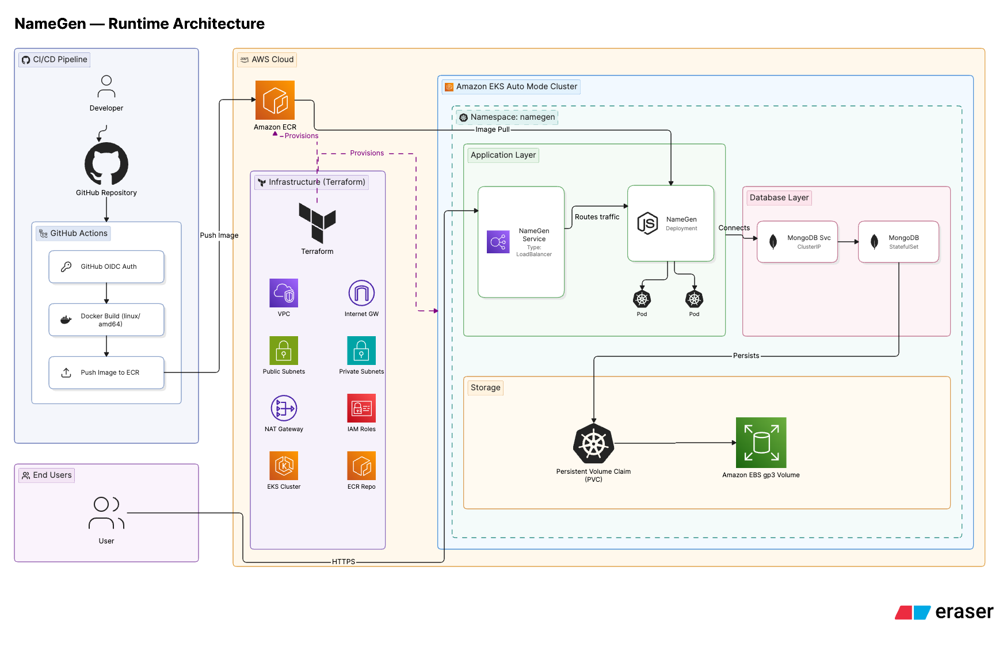
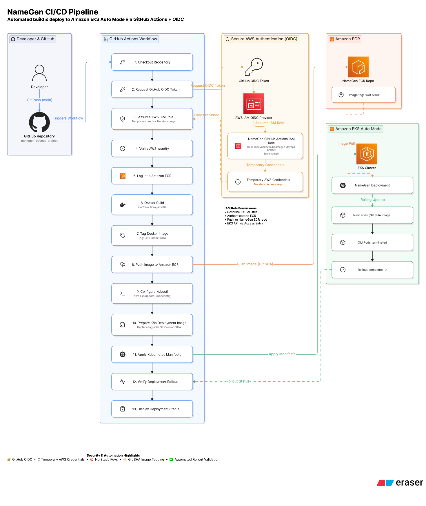
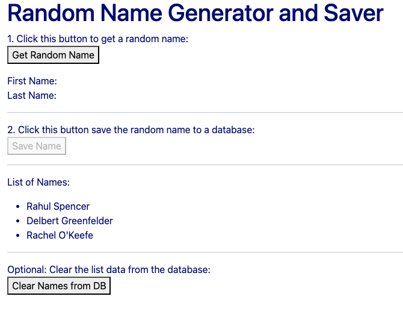
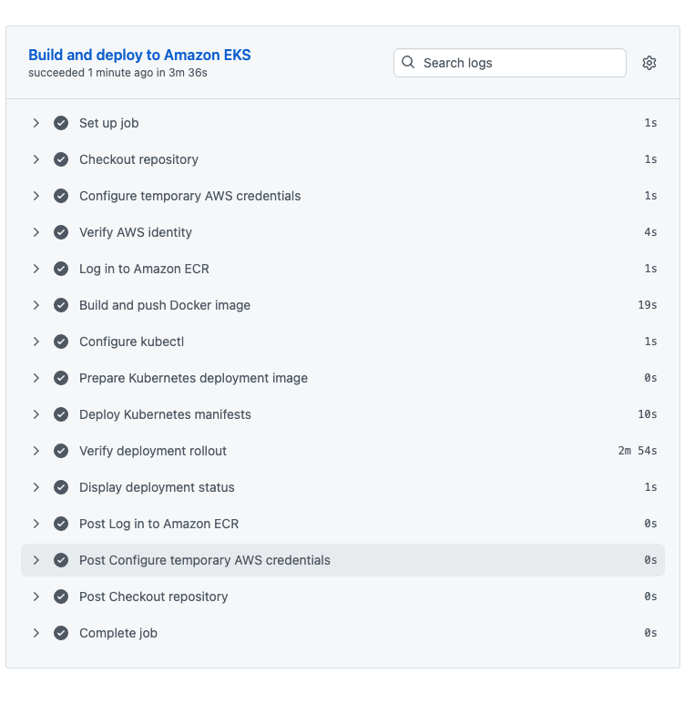

<a id="top"></a>

# 🎲 NameGen DevOps Project

---

## 🚀 Technologies Used

[](https://www.terraform.io/)
[](https://aws.amazon.com/eks/)
[](https://kubernetes.io/)
[](https://www.docker.com/)
[](https://github.com/features/actions)
[](https://docs.github.com/actions/deployment/security-hardening-your-deployments/about-security-hardening-with-openid-connect)
[](https://www.mongodb.com/)

A production-oriented DevOps implementation of the **NameGen** application deployed on **Amazon EKS Auto Mode** using **Terraform**, **Kubernetes**, **Docker**, **GitHub Actions**, and secure **GitHub OIDC** authentication.

---

# 📚 Table of Contents

- 📌 [Project Overview](#-project-overview)
- 🏗️ [Solution Architecture](#️-solution-architecture)
- 🔄 [CI/CD Pipeline](#-cicd-pipeline)
- ⭐ [Project Highlights](#-project-highlights)
- 🛠️ [Technology Stack](#️-technology-stack)
- 🔐 [Security Implementation](#-security-implementation)
- ⚙️ [Deployment Workflow](#️-deployment-workflow)
- 🚀 [End-to-End Deployment Guide](#-end-to-end-deployment-guide)
- ✅ [Validation](#-validation)
- 🧹 [Cleanup](#-cleanup)

---

# 📌 Project Overview

This project demonstrates a complete DevOps workflow for deploying the **NameGen** application on **Amazon EKS Auto Mode** using **Terraform**, **Docker**, **Kubernetes**, and **GitHub Actions**.

The infrastructure is provisioned with Terraform, container images are stored in Amazon ECR, and deployments are fully automated through GitHub Actions using secure GitHub OIDC authentication instead of long-lived AWS credentials.

The application consists of a stateless **Node.js** application deployed as a Kubernetes Deployment and a **MongoDB StatefulSet** backed by persistent **Amazon EBS gp3** storage.

The project demonstrates Infrastructure as Code, Kubernetes orchestration, secure CI/CD, persistent storage, rolling updates, and complete AWS resource cleanup.

<p align="center">
<a href="#top">⬆️ Back to Top</a>
</p>

---
# 🏗️ Solution Architecture

The solution is deployed on **Amazon EKS Auto Mode** and combines Infrastructure as Code, Kubernetes orchestration, persistent storage, and secure AWS networking.

Terraform provisions the complete AWS infrastructure, while Kubernetes manages the application workloads. The NameGen application runs as a Deployment behind a LoadBalancer Service and communicates internally with a MongoDB StatefulSet that stores data on an encrypted Amazon EBS gp3 volume.



### Architecture Summary

- Terraform provisions the AWS infrastructure.
- Amazon EKS Auto Mode hosts the Kubernetes workloads.
- Amazon ECR stores the application images.
- NameGen runs as a Kubernetes Deployment.
- MongoDB runs as a StatefulSet with persistent storage.
- Application traffic is exposed through an AWS Network Load Balancer.

<p align="center">
<a href="#top">⬆️ Back to Top</a>
</p>

---

# 🔄 CI/CD Pipeline

The deployment process is fully automated through **GitHub Actions** using **GitHub OIDC** authentication.

Every deployment builds a new Docker image, pushes it to Amazon ECR using the Git commit SHA as the image tag, updates the Kubernetes Deployment, and validates the rollout before completion.



### Pipeline Summary

1. Checkout Repository
2. Authenticate with GitHub OIDC
3. Assume AWS IAM Role
4. Build Docker Image (`linux/amd64`)
5. Push Image to Amazon ECR
6. Configure kubectl
7. Apply Kubernetes Manifests
8. Update Deployment Image
9. Verify Rollout Status

<p align="center">
<a href="#top">⬆️ Back to Top</a>
</p>

---

# ⭐ Project Highlights

- 🚀 Infrastructure provisioned with Terraform
- ☸️ Amazon EKS Auto Mode
- 🐳 Docker containerization
- 🔄 GitHub Actions CI/CD
- 🔐 GitHub OIDC authentication
- 📦 Amazon ECR image repository
- 🏷️ Git SHA image versioning
- 🌐 AWS Network Load Balancer
- 🗄️ MongoDB StatefulSet
- 💾 Amazon EBS gp3 persistent storage
- 🔁 Persistent data verified after Pod recreation
- 🧹 Complete AWS infrastructure cleanup

<p align="center">
<a href="#top">⬆️ Back to Top</a>
</p>

---

# 🛠️ Technology Stack

| Category | Technology |
|-----------|------------|
| Cloud Platform | AWS |
| Infrastructure as Code | Terraform |
| Container Orchestration | Amazon EKS Auto Mode |
| Containerization | Docker |
| Container Registry | Amazon ECR |
| CI/CD | GitHub Actions |
| Authentication | GitHub OIDC |
| Application | Node.js & Express |
| Database | MongoDB 3.6 |
| Workloads | Deployment & StatefulSet |
| Storage | Amazon EBS gp3 |
| Documentation | Markdown & Eraser |

<p align="center">
<a href="#top">⬆️ Back to Top</a>
</p>

---

# 🔐 Security Implementation

Security was implemented using AWS and GitHub best practices.

- 🔐 GitHub OIDC authentication
- 🔑 Temporary AWS credentials
- 🚫 No static AWS Access Keys
- 👤 Dedicated IAM Role for GitHub Actions
- 🛡️ Least Privilege permissions
- 📦 Private Amazon ECR access
- 🏷️ Git SHA image versioning
- 💾 Encrypted Amazon EBS gp3 storage

<p align="center">
<a href="#top">⬆️ Back to Top</a>
</p>

---

# ⚙️ Deployment Workflow

The deployment process consists of three stages:

### 1️⃣ Infrastructure

Terraform provisions:

- VPC
- Networking
- IAM
- Amazon ECR
- Amazon EKS Auto Mode
- GitHub OIDC integration

### 2️⃣ Kubernetes

Kubernetes deploys:

- Namespace
- StorageClass
- Secret
- ConfigMap
- MongoDB StatefulSet
- NameGen Deployment
- Services

### 3️⃣ CI/CD

GitHub Actions:

- Builds the Docker image
- Pushes the image to Amazon ECR
- Updates the Kubernetes Deployment
- Performs a rolling update
- Validates the rollout

<p align="center">
<a href="#top">⬆️ Back to Top</a>
</p>

---

# 🚀 End-to-End Deployment Guide

> **Note:** AWS resources created during this project may incur charges. Complete the cleanup section after validation.

## Prerequisites

Install and configure:

- Git
- AWS CLI
- Terraform
- Docker
- kubectl
- AWS account
- GitHub account

Verify the installation:

```bash
git --version
aws --version
terraform version
docker --version
kubectl version --client
```

---

## 1️⃣ Clone the Repository

```bash
git clone https://github.com/nadavh44/namegen-devops-project.git
cd namegen-devops-project
```

---

## 2️⃣ Configure AWS

Verify your identity:

```bash
aws sts get-caller-identity
aws configure get region
```

The project uses:

```text
Region: us-west-2
Cluster: namegen-eks
Repository: namegen
Branch: main
```

If required:

```bash
aws configure set region us-west-2
```

---

## 3️⃣ Deploy the Infrastructure

```bash
cd terraform

terraform fmt -recursive
terraform init
terraform validate
terraform plan
terraform apply
```

Confirm:

```text
yes
```

View the outputs:

```bash
terraform output
```

---

## 4️⃣ Configure kubectl

```bash
terraform output -raw configure_kubectl_command
```

Example:

```bash
aws eks update-kubeconfig \
  --region us-west-2 \
  --name namegen-eks
```

Verify cluster access:

```bash
kubectl get nodes
```

---

## 5️⃣ Configure GitHub Actions

Retrieve the IAM Role ARN:

```bash
terraform output -raw github_actions_role_arn
```

Create the following Repository Variable:

```text
Settings
→ Secrets and variables
→ Actions
→ Variables

AWS_DEPLOY_ROLE_ARN
```

Paste the Terraform output as the value.

---

## 6️⃣ Run the CI/CD Pipeline

Open:

```text
GitHub
→ Actions
→ NameGen CI/CD Pipeline
→ Run workflow
```

The workflow automatically:

- Builds the Docker image
- Pushes it to Amazon ECR
- Updates the Kubernetes Deployment
- Performs a rolling update
- Verifies the deployment

---

## 7️⃣ Verify the Deployment

```bash
kubectl get all -n namegen
kubectl get pvc -n namegen
kubectl get nodes
```

Retrieve the application URL:

```bash
kubectl get svc namegen -n namegen
```

Open the Load Balancer DNS name in your browser.

---

## 8️⃣ Validate the Application

Using the web interface:

- Generate a random name.
- Save the name.
- Generate additional names.
- Confirm all names remain visible.

---

## 9️⃣ Verify MongoDB

Enter the MongoDB Pod:

```bash
kubectl exec -it mongodb-0 -n namegen -- bash
```

Open the Mongo shell:

```bash
mongo
```

Verify the stored data:

```javascript
show dbs
use namegen
show collections
db.people.find().pretty()
```

Exit:

```javascript
exit
```

```bash
exit
```

---

## 🔟 Verify Persistent Storage

Delete the MongoDB Pod:

```bash
kubectl delete pod mongodb-0 -n namegen
```

Watch the StatefulSet recreate it:

```bash
kubectl get pods -n namegen -w
```

When `mongodb-0` returns to **Running**, refresh the application.

The previously saved names should still exist, confirming that the data is stored on the persistent Amazon EBS volume.

<p align="center">
<a href="#top">⬆️ Back to Top</a>
</p>

---

# ✅ Validation

## Running Application

The NameGen application was successfully deployed and accessible through the AWS Network Load Balancer.



---

## Successful GitHub Actions Workflow

The GitHub Actions pipeline completed successfully, including Docker image build, Amazon ECR push, Kubernetes deployment, and rollout validation.



---

### Validation Checklist

- ✅ Terraform infrastructure deployed successfully
- ✅ Amazon EKS Auto Mode cluster created
- ✅ Docker image pushed to Amazon ECR
- ✅ GitHub OIDC authentication succeeded
- ✅ Kubernetes Deployment rolled out successfully
- ✅ MongoDB StatefulSet running
- ✅ Persistent Volume Claim bound
- ✅ Application accessible through the Load Balancer
- ✅ Database persistence verified after Pod recreation

<p align="center">
<a href="#top">⬆️ Back to Top</a>
</p>

---

# 🧹 Cleanup

Destroy the infrastructure:

```bash
cd terraform
terraform destroy
```

Confirm:

```text
yes
```

Verify that no project resources remain:

```bash
aws eks list-clusters --region us-west-2

aws ecr describe-repositories --region us-west-2

aws ec2 describe-nat-gateways \
  --region us-west-2 \
  --query "NatGateways[?State!='deleted']"

aws elbv2 describe-load-balancers \
  --region us-west-2

aws ec2 describe-volumes \
  --region us-west-2
```

The final validation confirmed that all project resources were successfully removed from AWS.

---

<p align="center">
<a href="#top">⬆️ Back to Top</a>
</p>
